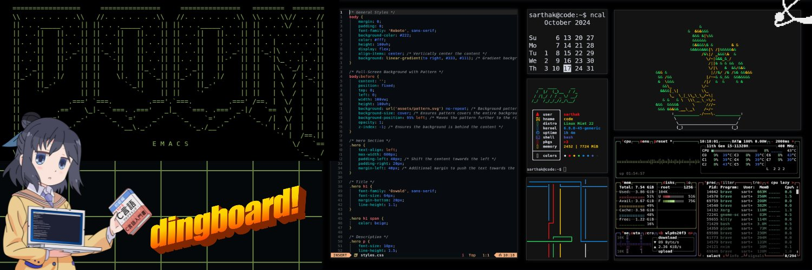

# Hi there 👋, I'm Sarthak aka Saro 🧑‍💻

Welcome to my little corner of the coding universe! 🌌  
I’m a **student**, **Linux enthusiast**, and an aspiring **programmer** with a focus on **Python** and **web development**. I'm passionate about **open-source**, **cryptocurrencies**, and **gaming**. Join me as I explore the ever-evolving world of tech!

 

## 🔧 I’m Currently Working With ...

### 🌐 Frontend Development

### 🖥️ Backend Development

### 💻 Occasionally Using ...

### 🛠️ Tools & Environments

## ✍️ Hobbies & Interests ...

  
  
  
  

## 📧 You Can Find Me Here ...

  
  

