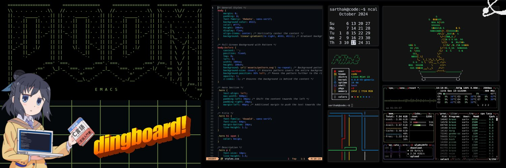

# Hello World! 👋 I'm Sarthak (Saro) 

<div align="center">
  
  
  [](https://github.com/codiwithsarthak?tab=followers)
  [](https://github.com/codiwithsarthak?tab=stars)
  [](https://github.com/codiwithsarthak)
</div>

## 🚀 About Me

> *"Code is poetry written in logic"* 

I'm a passionate student developer exploring the vast universe of technology! 🌌

- 🎓 Currently studying and building awesome projects
- 🐧 Linux enthusiast and open-source advocate
- 🌱 Always learning something new
- 🎮 Gamer by night, coder by day
- 🎨 Creative coder who loves to draw

## 💻 Tech Stack

### Languages & Frameworks
```text
Frontend     ████████░░░░   65%
Backend      ███████░░░░░   55%
Systems      █████░░░░░░░░   40%
```

#### 🎨 Frontend
[](https://github.com/codiwithsarthak)

#### 🔧 Backend
[](https://github.com/codiwithsarthak)

#### ⚙️ Other Languages
[](https://github.com/codiwithsarthak)

### 🛠️ Development Environment

<table>
  <tr>
    <th>Category</th>
    <th>Tools</th>
  </tr>
  <tr>
    <td>Editors</td>
    <td>
      <a href="#"></a>
      <a href="#"></a>
      <a href="#"></a>
    </td>
  </tr>
  <tr>
    <td>Operating Systems</td>
    <td>
      <a href="#"></a>
      <a href="#"></a>
    </td>
  </tr>
</table>

## 🌟 Interests & Hobbies

<div align="center">
  
  | 🎮 Gaming | 💰 Crypto | 🐧 Linux | ✏️ Drawing |
  |-----------|-----------|----------|------------|
  | Exploring virtual worlds | Investing & Learning | Customizing & Ricing | Digital & Traditional |
  
</div>

## 📊 GitHub Stats

<div align="center">
  
  
  
  
  
</div>

## 🤝 Let's Connect!

<div align="center">
  
  [](https://x.com/codewithsarthak)
  [](mailto:codewithsarthak@protonmail.com)
  
  <p>💬 Feel free to reach out for collaborations or just a friendly chat!</p>
  
</div>

---

<div align="center">
  
</div>
